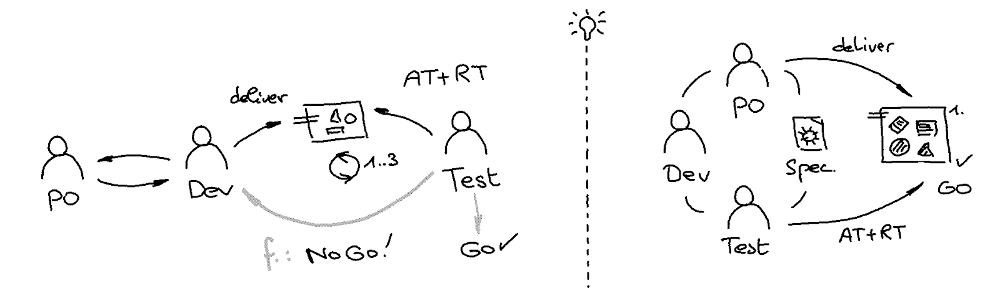

# Weaknesses and remedies

## Anomalies

Anomalies due to misalignments or lack of quality in the realisation can cause time-consuming ping-pong loops.

💡 Could an innovative approach that re-establishes a contractual element encourage greater accountability of each stakeholder for the quality of delivery?

## Cost of regression tests

The testing activity usually focuses on checking newly added features and regressions. Regression testing is time-consuming and should be automated, or, unfortunately, may be reduced to only the most essential features.

💡 Could we innovate on the tester's activity by automating it and giving them more impact upstream?

## Loss of trust

Anomalies, regressions, and misalignments can negatively impact the already established trust in the product itself, both within and outside the product team.

💡 Could a collaborative approach that promotes shared accountability, transparency and regular feedback during implementation build trust?

## Tunnel effect

The absence of continuous delivery means less feedback and, consequently, fewer opportunities to respond to any misalignment.

💡 Could the division of a feature into several deliverables containing one or more scenarios facilitate deliveries and thus feedback possibilities?

## Lack of documentation

What does the system solve? What are the features? What are the nominal and edge scenarios? What about testing evidence?

The Agile software development manifesto prioritises working software over comprehensive documentation. Therefore, the sources of documentation on what the developed system solves are production code, test code, and mental knowledge, often distributed across these. Consequently, more pressure is put on well-crafted code. In addition, narrative documentation sources can still be valuable for setting the context, but they are usually written at a high level and may no longer reflect the behaviour of the completed system.

💡 Could a collaborative approach restore a lightweight, human-readable digital artefact that contractually formalises common understanding and be a source of living documentation that provides features and testing evidence?

