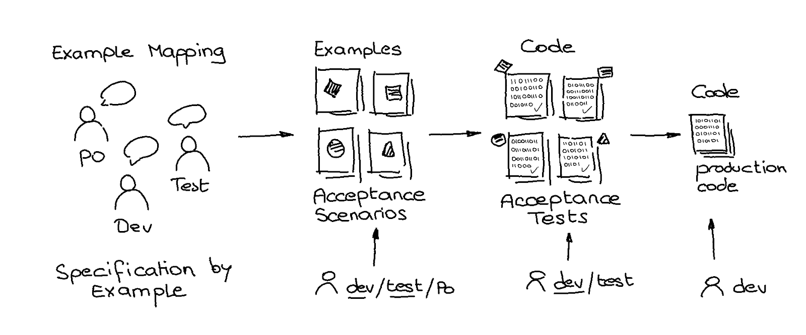

# BDD in Practice



A specification-by-example activity facilitates a common understanding of expected behaviour through examples. It applies to a wide range of use cases across any domain: calculation, aggregation, orchestration, eventing, management, and workflow.

- The **Specification-by-Example** activity is conducted during **Example Mapping** sessions.
- Formalisation of expected system behaviour is achieved through **acceptance scenarios** expressed in the domain language and formalised using [Gherkin](https://cucumber.io/docs/gherkin/) syntax.
- It requires practice; finding good wording has to be learned by doing. Efficient wording can be easily understood, validated, and automated.
- Automated testing means developing **automated acceptance tests** using glue code.
- The development of production code is then driven by existing acceptance tests (ATDD).

## Three amigos


The conversations in the Specification by Example activity result from the interaction of three actors with different perspectives, brought together for the same purpose: the product person or domain expert, the software engineer, and the test engineer.

## Example Mapping

An Example mapping session facilitates **structured conversations** between the three amigos. It allows identifying user stories, open questions, business rules, and examples.


[xebia.com/blog/example-mapping-steering-the-conversation](xebia.com/blog/example-mapping-steering-the-conversation)

### Feature, story, business rule, scenario, example

- One **feature** is explained by one or more **scenarios** grouped in **stories**.
- One story usually groups one or more scenarios and represents a feature increment with business value.
- One or more scenarios or examples typically support a single **business rule**.
- One or more **examples** support one scenario.
- One scenario for each nominal case.
- One scenario for each edge case.
- One scenario for each negative or error case.

## Scenarios writing

Writing scenarios helps build a common, ubiquitous language that everyone can understand and validate.

As it requires some experience and a particular way of thinking, it is recommended that the test engineer or the software engineer perform this activity. Feedback from the Product person can be done once they have drafted the [Gherkin](https://cucumber.io/docs/gherkin/) specification.

A scenario consists of a set of preconditions about the initial state or context, a set of actions (usually one), and a set of assertions (or postconditions) about the final state or context.

### Functional scenarios

```gherkin
Feature: To be able to manage a set of existing clients in a persistent way

 Background:
   Given the following set of existing clients
   | model-id | id | name | age | creation-date |
   | 1 | ce751f30-217a-422c-b81b-8f75df4917b6 | client1 | 21 | 2020-10-10T12:00:00 |
   | 2 | 29e364b9-f5ef-43d9-9f30-e07a30b73e01 | client2 | -  | 2020-10-09T12:00:00 |


 Rule: An existing client is a persisted resource in the system.

   Scenario: Add a new client to the existing clients

     Given the following set of client attributes
       | name | age |
       | test | 22  |
     And the next identifier is afd9ce9f-ee0e-4547-8c77-3cc43ec85dbc
     And the next timestamp is 2020-10-11T12:00:00
     When registering the new client
     Then the response status is CREATED
     And the attributes of the returned client are the following
       | id                                   | name | age | creation-date       |
       | afd9ce9f-ee0e-4547-8c77-3cc43ec85dbc | test | 22  | 2020-10-11T12:00:00 |
     And the returned client is added to the set of existing clients
```

### Non-functional scenarios (NFR)

```gherkin
Feature: To be able to manage a set of existing clients in a persistent way

 Background:
   Given the following set of existing clients
   | model-id | id | name | age | creation-date |
   | 1 | ce751f30-217a-422c-b81b-8f75df4917b6 | client1 | 21 | 2020-10-10T12:00:00 |
   | 2 | 29e364b9-f5ef-43d9-9f30-e07a30b73e01 | client2 | -  | 2020-10-09T12:00:00 |


 Rule: An existing client is a persisted resource in the system.

   Scenario: Add a new client to the existing clients

     Given the following set of client attributes
       | name | age |
       | test | 22  |
     And the next identifier is afd9ce9f-ee0e-4547-8c77-3cc43ec85dbc
     And the next timestamp is 2020-10-11T12:00:00
     When registering the new client
     Then the response status is CREATED
     And the attributes of the returned client are the following
       | id                                   | name | age | creation-date       |
       | afd9ce9f-ee0e-4547-8c77-3cc43ec85dbc | test | 22  | 2020-10-11T12:00:00 |
     And the returned client is added to the set of existing clients
```

More scenarios: [Blueprint API](https://github.com/vondacho/arch-blueprint-kotlin/tree/master/src/acceptanceTest/resources/features/client)

## Scenarios validation

Every scenario has to be validated by every stakeholder or amigo, so that it describes an expected facet of the system behaviour. As a result, shared understanding is materialised into a digital set of acceptance scenarios that establishes a **digital contract** between all stakeholders.

These acceptance scenarios form the foundation of an executable specification and the building blocks for defining **acceptance tests**.

## Acceptance testing

Acceptance tests support high-level **functional and non-functional** testing, including testing new feature increments and regression testing.

This activity is usually done by a test engineer of a quality assurance team to validate a delivered feature increment before its deployment to production. BDD promotes a shift-left approach, making both the Developer and QA engineer roles accountable for acceptance testing.

## ATDD

ATDD is a test-driven development technique based on acceptance tests, used by software engineers to drive development toward the expected system behaviour.

> Given an acceptance scenario, a failing acceptance test is written first, and the software engineer writes the minimal production code to pass it. This process is repeated with the next acceptance scenario, along with a refactoring phase applied to both test and production code to ensure well-crafted code and design.

This cycle executed at the feature level may include an inner TDD cycle at the component level; this technique is called Outside-in 
TDD.

## BDD and ATDD

ATDD is used with BDD to automate acceptance scenarios; each scenario corresponds to a single acceptance test.

## BDD glue code, test code, and production code


- The test code implements acceptance tests and interacts with the production code.
- BDD glue code implements the mapping of BDD steps written in natural language into test code.
- BDD steps are mapped by BDD glue code into test code written in a given technology.
- BDD frameworks (Cucumber, Behave) traverse test steps and automate test execution.

```java
@When("mumbling {word}") //glue code
fun mumble(text: String) { //glue code
   TestContext.put("mumbling.result", //test code
   MumblingStrategy().mumble(text)) //test code calls production code
}

@Then("the result of mumbling is {word}") //glue code
fun mumblingResultIs(expected: String) { //glue code
   val result: String = TestContext.at("mumbling.result") //test code
   assertThat(result).isEqualTo(expected) //test code
}
```

More glue code: [Blueprint API](https://github.com/vondacho/arch-blueprint-kotlin/tree/master/src/acceptanceTest/kotlin/edu/obya/blueprint/client/at/steps)

## BDD with acceptance tests

### Scope

Well-written BDD scenarios are written in a naturally high-level domain language. One scenario could be automated to target either a user interacting with a front-end application, a web API, or a component that supports application or domain logic. A specific glue code developed for each target enables this decoupling.


### Remarks and recommendations

**Acceptance tests** are high-level integration tests defined at the feature level. Supported by natural language and Gherkin syntax, their self-documentation is accessible to all stakeholders and emphasises the implemented and tested behaviour, including its preconditions and postconditions. They usually cover functional requirements and may also test non-functional requirements. They should be applied to both the Application architecture layer and the Domain architecture layer.

**Contract tests** apply to the web infrastructure layer and checks the implementation of the web API against the pre-existing API specification contract.

**Smoke tests** may be a subset of nominal acceptance tests to be played in the production environment to check the availability of the expected functional behaviour.

**xUnit tests**, due to their technical nature, do not resonate with all stakeholders and therefore do not provide evidence of which functional requirements are implemented and tested.

Examples:
- [Blueprint API - AT at the API level](https://github.com/vondacho/arch-blueprint-kotlin/tree/master/src/acceptanceTest/kotlin/edu/obya/blueprint/client/at)
- [Blueprint API - AT at the domain level](https://github.com/vondacho/arch-blueprint-kotlin/tree/master/src/acceptanceTest/kotlin/edu/obya/blueprint/problemsolving/at)
- [Blueprint API - Contract tests](https://github.com/vondacho/arch-blueprint-kotlin/tree/master/src/contractTest/kotlin/edu/obya/blueprint/client/cdc)
- [Blueprint API - xUnit tests](https://github.com/vondacho/arch-blueprint-kotlin/tree/master/src/test/kotlin/edu/obya/blueprint/client)

## BDD and agility

**Agile ideology** influences methodologies that support iterative development in small increments, enabling quick feedback and adaptation.

Delivering the most valuable scenarios within one or more stories has a natural priority, and a further valuable set of scenarios can be delivered in subsequent increments.

Scenarios are developed against single acceptance tests, which can be executed by a continuous integration tool. This tooling can be configured to monitor which scenarios have been delivered and which ones are still under development. This promotes transparency and enables early feedback, reactions, and predictions leading up to the deadline.


[plugins.jenkins.io/cucumber-reports/](plugins.jenkins.io/cucumber-reports/)

## Living documentation

A BDD-driven specification and [Serenity-BDD](https://serenity-bdd.github.io/docs/guide/user_guide_intro) tooling enable living documentation

## Evidence of system well-being

With [Serenity-BDD](https://serenity-bdd.github.io/docs/guide/user_guide_intro) test execution reports, auditors can be provided with proof that all requirements covered by the system in place are supported by documented, continuous acceptance tests. It supports Java technology only.

With [Allure](http://allure.qatools.ru/) test execution reports, more evidence can be provided to auditors that testing is done in depth, even at lower levels of the test pyramid (e.g., component integration testing and component unit testing), and is uniformly applied across multiple technologies (Python/Java/Kotlin).
