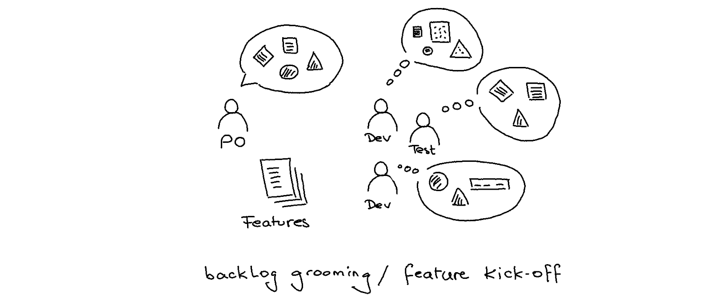
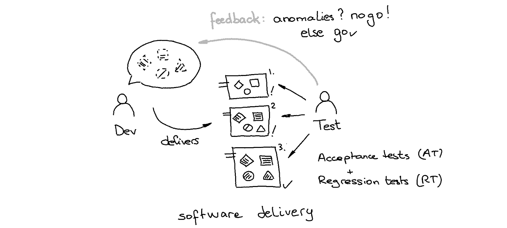

# Traditional approach

## Backlog building

The product owner listens to customer needs; the product owner owns and manages a product backlog composed of features that extend the current product capabilities or current system behaviour.

## Features understanding

The product owner explains the expected system behaviour to software and test engineers; they try to align their understanding with the product owner's vision, challenging him with their perspective during backlog grooming or feature kick-off sessions.

## Software delivery

The test engineer verifies every delivered functional increment; he checks its completeness and correctness and, with best effort, its absence of regression. Anomalies are returned to the development team for the next delivery.
