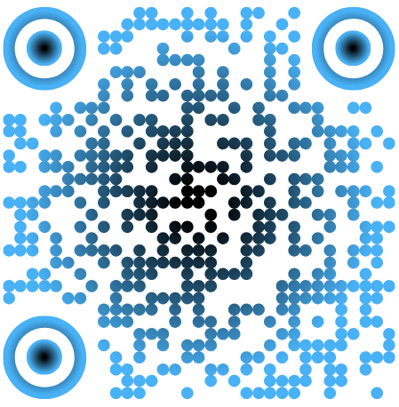

# About me
Olivier von Dach, Lausanne, CH, 1972, FR|EN|DE|ES
Career started in 1996.
Passionate about Software Development.
Continuous learner.
Quality-driven Software Development promoter.
Multi-role competency.
Courage, Honesty, Empathy.

 <!-- Setting width to 200px -->

---

# Where I want to work
I can develop myself.
I can use all my different skills.
There is an interest or need for better software products.
People are open to change, improvement, and innovation.
Alignment with my professional values.

---

# Why this position
This is an opportunity.
Curiosity about medical context.
Position aligned with my current technical and soft skills.
My experience should help me.them.

---

# Other
Notice period for my employment contract: 2 months.
Teleworking authorised, minimum 2 days.
Availability: October 2025.
